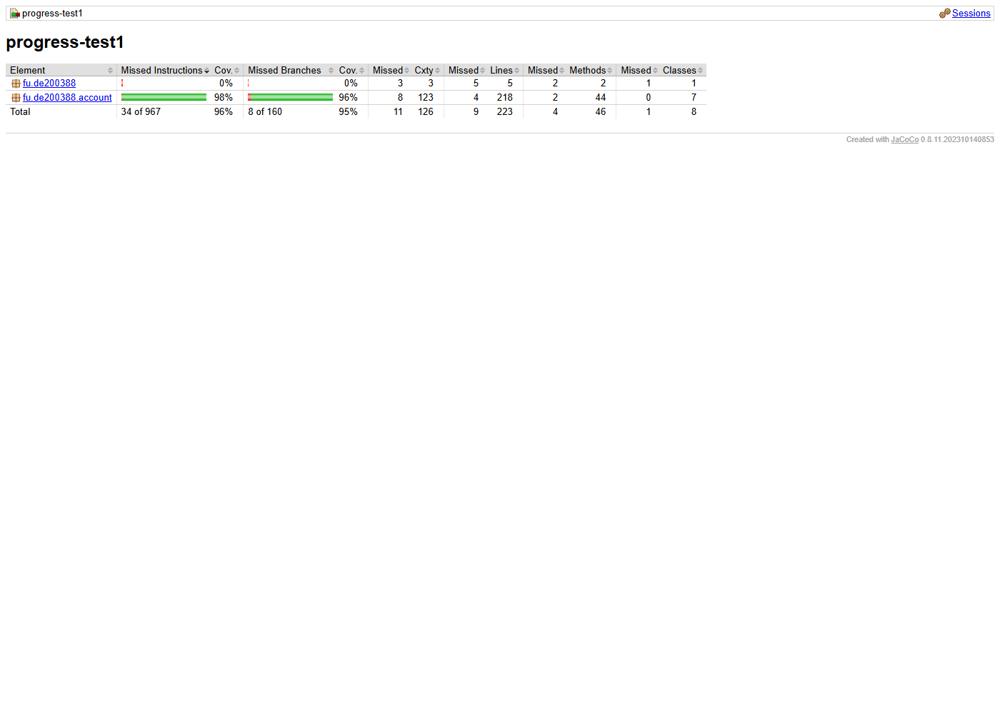

# Progress Test 1 - Account Management Testing

## 1. How to Run

### Requirements
- Java 21
- Maven

### Run all tests

```bash
cd progress-test1
mvn clean test
```

Expected result:

```text
Tests run: 191, Failures: 0, Errors: 0, Skipped: 0
BUILD SUCCESS
```

## 2. Test Results

| Item | Result |
|---|---:|
| Total tests | 191 |
| Failures | 0 |
| Errors | 0 |
| Skipped | 0 |
| Build | SUCCESS |

## 3. JaCoCo Coverage

Generate the report with:

```bash
cd progress-test1
mvn clean test
```

Open:

```text
progress-test1/target/site/jacoco/index.html
```

Coverage target: `AccountValidator` and `AccountService` must reach Line >= 80% and Branch >= 70%.

| Class | Line Coverage | Branch Coverage | Requirement |
|---|---:|---:|---|
| AccountValidator | 100% | 98% | PASS |
| AccountService | 100% | 94% | PASS |

### Coverage Screenshot



## 4. Manual Mutation Testing

Each mutation was inserted one at a time, tested with `mvn clean test`, then reverted with `git checkout -- <file>`.

| # | Mutation | Failing test(s) | Reverted |
|---|---|---|---|
| M1 | `login()`: `>= MAX_FAILED_ATTEMPTS` changed to `> MAX_FAILED_ATTEMPTS` | `login_WrongPassword5thTime_LocksAccount`; also `login_WhileLocked_RejectsWithoutIncrement`, `login_CorrectPasswordAfterNFailures` | Yes |
| M2 | `login()`: removed `if (account.isLocked())` branch | `login_WhileLocked_RejectsWithoutIncrement`; also `login_CorrectPasswordAfterNFailures` | Yes |
| M6 | `Account.unlock()`: removed `failedAttempts = 0` | `login_AfterAdminUnlock_CounterRestartsAndCanLogin`; also `resetPassword_Success_UnlocksAndTokenSingleUse` | Yes |

Final verification after reverting all mutations:

```text
Tests run: 191, Failures: 0, Errors: 0, Skipped: 0
BUILD SUCCESS
```

## 5. Requirement Traceability Matrix

| Business Requirement | Test(s) |
|---|---|
| BR-REG-01 - required input and DOB not in future | `register_InvalidInput_ReturnsExpectedCode`, `register_UsernameNullEmptyBlank_ReturnsInvalidInput`, `register_EmailNullEmptyBlank_ReturnsInvalidInput`, `register_PasswordNullEmptyBlank_ReturnsInvalidInput` |
| BR-REG-02 - username format | `isValidUsername_ValidValues_ReturnsTrue`, `isValidUsername_InvalidValues_ReturnsFalse`, `register_InvalidInput_ReturnsExpectedCode` |
| BR-REG-03 - duplicate username ignored case | `register_DuplicateUsernameIgnoreCase_ReturnsDuplicateUsername` |
| BR-REG-04 - email format | `isValidEmail_Partitions`, `isValidEmail_BoundaryLength`, `register_InvalidInput_ReturnsExpectedCode` |
| BR-REG-05 - duplicate email ignored case | `register_DuplicateEmailIgnoreCase_ReturnsDuplicateEmail` |
| BR-REG-06 - password strength | `isValidPassword_Partitions`, `isValidPassword_BoundaryLength`, `register_InvalidInput_ReturnsExpectedCode` |
| BR-REG-07 - password confirmation | `register_InvalidInput_ReturnsExpectedCode` |
| BR-REG-08 - minimum age 18 | `calculateAge_Boundaries`, `register_AgeBoundary` |
| BR-REG-09 - optional phone with valid format | `isValidPhone_ValidPrefixes_ReturnsTrue`, `isValidPhone_InvalidValues_ReturnsFalse`, `register_PhoneNullOrEmpty_Success` |
| BR-REG-10 - successful account creation and hashed password | `register_ValidData_CreatesActiveAccountWithHashedPassword`, `register_TwoAccountsSamePassword_HaveDifferentSaltAndHash` |
| BR-LOG-01 - login input required | `login_UsernameNullEmptyBlank_ReturnsInvalidInput`, `login_PasswordNullEmptyBlank_ReturnsInvalidInput` |
| BR-LOG-02/03 - unknown user or wrong password | `login_UnknownUserAndWrongPassword_ReturnSameCode`, `login_PasswordCaseSensitive_ReturnsInvalidCredentials` |
| BR-LOG-04 - disabled account cannot login | `login_DisabledAccount_ReturnsAccountDisabled` |
| BR-LOG-05 - failed attempts are counted | `login_WrongPasswordLessThan5Times_IncrementsCounter` |
| BR-LOG-06 - locked account is rejected | `login_WrongPassword5thTime_LocksAccount`, `login_WhileLocked_RejectsWithoutIncrement` |
| BR-LOG-08 - successful login resets failed attempts | `login_SuccessAfterFailures_ResetsCounter`, `login_CorrectPasswordAfterNFailures` |
| BR-ADM-03 - admin can unlock account | `login_AfterAdminUnlock_CounterRestartsAndCanLogin`, `unlockAccount_BlankOrUnknown_ReturnsUserNotFound` |
| BR-CHG-01..08 - change password rules | `changePassword_Rules`, `changePassword_Valid_OldPasswordNoLongerWorks`, `changePassword_ReuseWithinLast3_Rejected_ThenAllowedAfterRollingOut` |
| BR-RST-01..06 - password reset rules | `requestPasswordReset_BlankEmail_ReturnsInvalidInput`, `requestPasswordReset_UnknownOrDisabled`, `resetPassword_Success_UnlocksAndTokenSingleUse`, `resetPassword_NewRequest_InvalidatesOldToken`, `resetPassword_RejectedPassword_TokenStillValid`, `resetPassword_UnknownToken_ReturnsInvalidToken` |

## 6. Completion Checklist

- [x] `mvn clean test` passes
- [x] 191 tests
- [x] 0 failures
- [x] 0 errors
- [x] 0 skipped
- [x] AccountValidator Line Coverage >= 80%
- [x] AccountValidator Branch Coverage >= 70%
- [x] AccountService Line Coverage >= 80%
- [x] AccountService Branch Coverage >= 70%
- [x] JaCoCo coverage screenshot added
- [x] At least 3 manual mutations detected by tests
- [x] All manual mutations reverted
- [x] Requirement traceability matrix completed
- [x] Final project ready for submissionss
